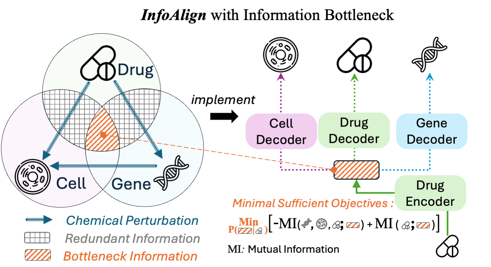

# Learning Molecular Representation in a Cell

**InfoAlign** learns molecular representations from bottleneck information derived from molecular structures, cell morphology, and gene expressions. For more details, please refer to our [paper](https://arxiv.org/abs/2406.12056v1).



## Requirements

This project was developed and tested with the following versions:

- **Python**: 3.11.7
- **PyTorch**: 2.2.0+cu118
- **Torch Geometric**: 2.6.1

All dependencies are listed in the `requirements.txt` file.

### Setup Instructions

1. **Create a Conda Environment**:
    ```bash
    conda create --name infoalign python=3.11.7
    ```

2. **Activate the Environment**:
    ```bash
    conda activate infoalign
    ```

3. **Install Dependencies**:
    ```bash
    pip install -r requirements.txt
    ```

## Usage

### Fine-tuning

We provide a pretrained checkpoint available for download from [Hugging Face](https://huggingface.co/liuganghuggingface/InfoAlign-Pretrained). For fine-tuning and inference, use the following commands. The pretrained model will be automatically downloaded to the `ckpt/pretrain.pt` file by default.

```bash
python main.py --model-path ckpt/pretrain.pt --dataset finetune-chembl2k
python main.py --model-path ckpt/pretrain.pt --dataset finetune-broad6k
python main.py --model-path ckpt/pretrain.pt --dataset finetune-biogenadme
python main.py --model-path ckpt/pretrain.pt --dataset finetune-moltoxcast
```

Alternatively, you can manually download the model weights and place the `pretrain.pt` file under the `ckpt` folder along with its corresponding YAML configuration file.

**Note**: If you wish to access the cell morphology and gene expression features in the ChEMBL2k and Broad6K datasets for baseline evaluation, visit our [Hugging Face repository](https://huggingface.co/liuganghuggingface/InfoAlign-Pretrained) to download these features.

### Pretraining

To pretrain the model from scratch, execute the following command:

```bash
python main.py --model-path "ckpt/pretrain.pt" --lr 1e-4 --wdecay 1e-8 --batch-size 3072
```

This will automatically download the pretraining dataset from [Hugging Face](https://huggingface.co/datasets/liuganghuggingface/InfoAlign-Data). If you prefer to download the dataset manually, place all pretraining data files in the `raw_data/pretrain/raw` folder.

The pretrained model will be saved in the `ckpt` folder as `pretrain.pt`.

---

## Data source

For readers interested in data collection, here are the sources:

1. **Cell Morphology Data**
   - JUMP dataset: The data are from "JUMP Cell Painting dataset: morphological impact of 136,000 chemical and genetic perturbations" and can be downloaded [here](https://github.com/jump-cellpainting/datasets/blob/1c245002cbcaea9156eea56e61baa52ad8307db3/profile_index.csv). The dataset includes chemical and genetic perturbations for cell morphology features.
   - Bray's dataset: "A dataset of images and morphological profiles of 30,000 small-molecule treatments using the Cell Painting assay". Download from [GigaDB](http://gigadb.org/dataset/100351). Processed version available on [Zenodo](https://zenodo.org/records/7589312).

2. **Gene Expression Data**
   - LINCS L1000 gene expression data from the paper "Drug-induced adverse events prediction with the LINCS L1000 data": [Data](https://maayanlab.net/SEP-L1000/#download).

3. **Relationships**
   - Gene-gene, gene-compound relationships from Hetionet: [Data](https://github.com/hetio/hetionet).

# Citation

If you find this repository useful, please cite our paper:

```
@article{liu2024learning,
  title={Learning Molecular Representation in a Cell},
  author={Liu, Gang and Seal, Srijit and Arevalo, John and Liang, Zhenwen and Carpenter, Anne E and Jiang, Meng and Singh, Shantanu},
  journal={arXiv preprint arXiv:2406.12056},
  year={2024}
}
```

